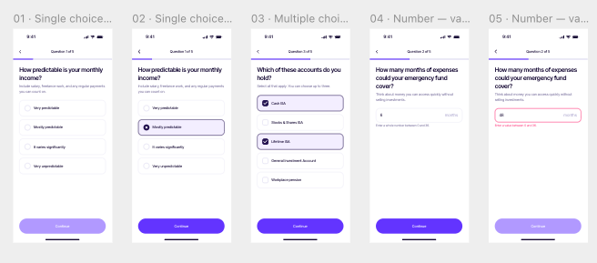
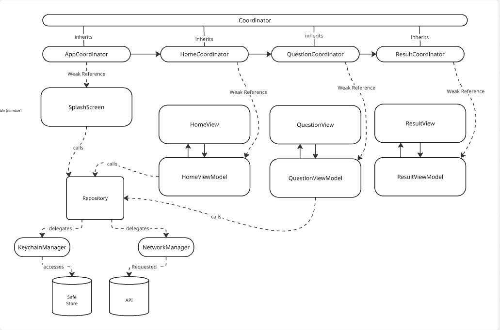
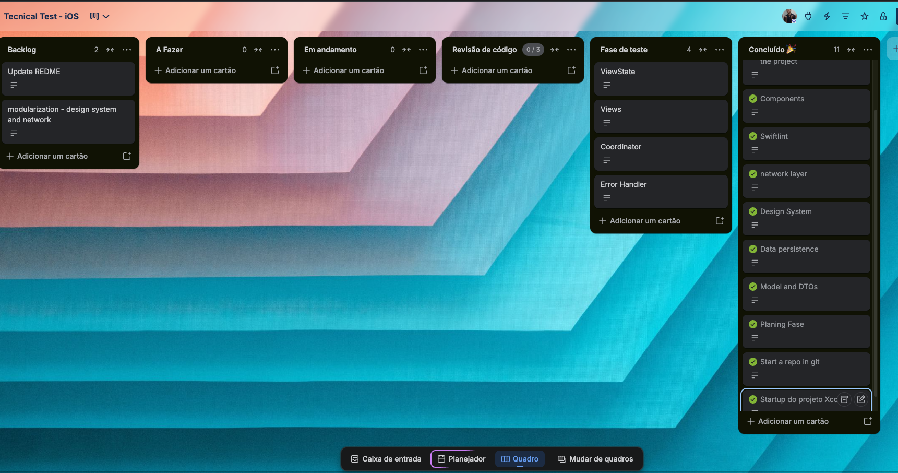

# Financial Health Check

An iOS client for a server-driven financial health-check questionnaire. The backend already
exists — this project is the native app that walks a user through a short, dynamic
questionnaire and shows their resulting financial health score.

## Overview

The flow has three stages, each driven entirely by the API's response rather than any
client-side script:

1. **Start** — an intro screen with a "Start" button, which begins (or resumes) a session.
2. **Question** — one question at a time (`single_choice`, `multiple_choice`, or `number`),
   submitted one at a time; the server's response to each submission is either the next
   question or the final result.
3. **Result** — the session's score and category (`poor`/`fair`/`good`/`excellent`), with the
   option to retake the questionnaire.

The app persists the in-progress session's id locally (Keychain), so relaunching mid-flow
resumes exactly where the user left off instead of restarting.

## How to Run

1. Open `financialHealthCheck/financialHealthCheck.xcodeproj` in Xcode (iOS 26.5+ SDK, Swift 5).
2. Select the `financialHealthCheck` scheme and run on a simulator or device — no signing/
   environment setup needed.
3. The API base URL is read from `Info.plist` (`API_BASE_URL`), already pointing at
   `https://api.peakers.workers.dev`, so the app runs against the live spec out of the box.
4. To run the unit tests: `Cmd+U` in Xcode, or `xcodebuild test` on the
   `financialHealthCheckTests` target.

## Design Resources

- **[Figma — Design System](https://www.figma.com/design/ztqxSwQ9AkH2HKyADYnw68/iOS-Assignment-Design-System-v3?node-id=0-1&p=f&t=HdinADG2WpTggoVH-0)**
  — the source of truth for every design-system component (`designSystem/`), colors,
  typography, and spacing.
- **[Paper — Navigation Flow](https://app.paper.design/file/01KZVRH6WWBZJBSHJXMCNH8ZPJ/1-0)**
  — the app's screen-to-screen navigation flow, mirrored by the Coordinator tree.
- **[Miro — Data Modeling](https://miro.com/app/board/uXjVHynVQDI=/)**
  — the modeling behind the `model/` DTOs and the API's request/response shapes.
- **[Trello — Task Board](https://trello.com/invite/b/6a7b98698efd5bf9bb675f41/ATTI61ca57773a93b3033330d2b7f98de2b89E28D277/tecnical-test-ios)**
  — task tracking for this assignment.



## High-Level Design



The app follows **MVVM-C** (Model, View, ViewModel, Coordinator):

- **Model** — plain `Codable` DTOs (`model/`), all-optional fields since every shape is
  server-driven.
- **View** — SwiftUI screens (`View/`), built from reusable `designSystem/` components.
- **ViewModel** — one `ObservableObject` per screen (`ViewModel/`), holding that screen's state
  and calling into `HealthCheckRepository` for data.
- **Coordinator** — one per flow (`coordinators/`), owning navigation and wiring each
  ViewModel's callbacks to "what happens next."

Dependency injection is plain constructor injection, no framework: `AppCoordinator` creates a
single `HealthCheckRepository` and threads it down through every child Coordinator's
initializer, which in turn passes it into the ViewModel it creates.

### Key Decisions

- **MVVM-C over MVVM alone** — every ViewModel holds 100% of the screen's decision logic, so
  Views stay dumb (render-only) and Coordinators stay navigation-only. That split is also what
  makes the ViewModels unit-testable in isolation (see `financialHealthCheckTests`).
- **Session id in Keychain, not `UserDefaults`** — the assignment requires the session to
  survive a force quit; Keychain is the standard place for something that identifies a user's
  in-progress state and needs to persist reliably across launches.
- **One shared `HealthCheckSessionDTO` shape for both endpoints** — start/resume and submit both
  return `{ status, question?, result?, progress }`, so one model and one decode path handles
  "what happens next," instead of two parallel response types.
- **`NetworkManager` is fully generic** — it knows nothing about the health-check domain;
  `HealthCheckRepository` is the only layer with domain-named operations
  (`startSession()`, `submitAnswer(_:)`). This keeps ViewModels unaware they're talking to a
  network at all, and keeps the transport layer reusable if the app grows more endpoints.

## Assumptions & Trade-offs

Given the assignment's scope, a few things were deliberately left as open edges rather than
fully hardened, and are called out here instead of being silently shipped:

- **No re-entrancy guard on "Start"/"Continue"/"Retake"** — none of the three ViewModels expose
  an `isLoading` state yet, so a fast double-tap (or a tap during network latency) can fire the
  same request twice. Traded off against the scope of a take-home assignment; a real app would
  need this.
- **Back button during the question flow isn't disabled** — the user can navigate back to an
  already-answered question. The API doesn't allow re-answering a completed question, so
  resubmitting currently fails silently instead of surfacing an error or locking the screen.
- **"Finish" on the Result screen has no defined behavior** — unlike "Retake" (clears the
  session, returns to Start), there's no product spec for what completing the flow for good
  should do, so it's currently a no-op.
- **A transient network failure at launch is treated the same as "no session"** — both fall
  back to the Start screen. A `sessionNotFound` response also doesn't clear the stale session id
  from the Keychain, so a dead id would keep failing the same way on every relaunch.
- **`.number` questions are assumed to always be currency** — the API doesn't send a unit/format
  hint per question, so the text field hardcodes a `€` prefix. This holds for every question
  seen so far, but isn't guaranteed by the spec.
- **`minSelections`/`maxSelections` are decoded but not enforced** — `.multipleChoice` only
  requires "something is selected" to continue, not that the count falls within the range the
  API sends.
- **Coordinators are never released once their screen is gone** — each coordinator appends every
  coordinator it creates to a `childCoordinators` array and never removes one, so the chain only
  grows; retaking the questionnaire stacks a new attempt on top of the previous one instead of
  replacing it. Each one only holds a small DTO and two closures, and a session realistically
  spans a handful of questions, so the memory cost stays negligible at this scope — fixing it
  properly (tying a coordinator's lifetime to its own screen, or resetting from whichever
  coordinator owns the top of the chain) was judged not worth the added complexity for a
  take-home of this size.

## Significant Libraries/Dependencies

**None.** The app is built entirely on first-party frameworks — SwiftUI, Combine (every
ViewModel is an `ObservableObject`), `URLSession` (via `NetworkManager`), and Keychain Services
(via `KeychainManager`). For this assignment's scope (two endpoints, no image loading, no
complex retry/caching needs), a third-party networking library would have added a dependency
with no real capability gap to fill. The only external tool is **SwiftLint**, dev-only (not
linked into the app), configured via `financialHealthCheck/.swiftlint.yml`.

## Project Structure

```
Financial-Health-Check/
├── README.md                  This file.
└── financialHealthCheck/
    └── financialHealthCheck/
        ├── AppDelegate.swift
        ├── SceneDelegate.swift          Creates and starts `AppCoordinator`.
        ├── Strings.swift                Every user-facing string, grouped by screen.
        ├── String+Empty.swift           `Optional<String>.isNilOrEmpty`.
        │
        ├── model/                       Codable DTOs — the API's request/response shapes.
        │   ├── DTO.swift                 Marker protocol every model conforms to.
        │   ├── HealthCheckSessionDTO.swift   Shared response shape for both endpoints.
        │   ├── QuestionDTO.swift
        │   ├── QuestionOptionDTO.swift
        │   ├── QuestionType.swift        `single_choice` / `multiple_choice` / `number`.
        │   ├── QuestionValidationDTO.swift
        │   ├── ProgressDTO.swift
        │   ├── ResultDTO.swift
        │   ├── ResultCategory.swift      `poor` / `fair` / `good` / `excellent`.
        │   ├── AnswerValue.swift         Custom-encoded answer (string, array, or number).
        │   ├── SubmitAnswerRequestDTO.swift
        │   └── APIErrorDTO.swift         Decoded from non-2xx responses.
        │
        ├── services/                    Generic infrastructure — no domain knowledge.
        │   ├── NetworkManager.swift      Generic HTTP transport (encode/decode/validate).
        │   ├── Endpoint.swift            URL base + path segments.
        │   ├── NetworkError.swift        Typed errors, mapped from the API's error codes.
        │   └── KeychainManager.swift     Persists the session id; the only Keychain access.
        │
        ├── repositories/                Domain operations — the only thing ViewModels use.
        │   └── HealthCheckRepository.swift   `startSession()`, `submitAnswer(_:)`, etc.
        │
        ├── coordinators/                Navigation — one per flow.
        │   ├── Coordinator.swift         Base protocol (`func start()`).
        │   ├── AppCoordinator.swift       Root — resolves session state, routes to a flow.
        │   ├── StartCoordinator.swift
        │   ├── QuestionCoordinator.swift  Pushes one question at a time.
        │   └── ResultCoordinator.swift
        │
        ├── ViewModel/                   One `ObservableObject` per screen.
        │   ├── StartViewModel.swift
        │   ├── QuestionaryViewModel.swift
        │   └── ResultViewModel.swift
        │
        ├── View/                        SwiftUI screens.
        │   ├── StartView.swift
        │   ├── QuestionaryView.swift
        │   └── ResultView.swift
        │
        └── designSystem/                Reusable, screen-agnostic UI building blocks.
            ├── colorPalette/             `Palette`, `DesignSystemColor`, `Color+Hex`.
            ├── typographyScale/          `Typography`, `TypographyToken`, UIKit/SwiftUI bridges.
            ├── spacingScale/             `Spacing`.
            ├── icons/                    `Icon`.
            ├── buttons/                  `AppButton`, `ButtonDock`, styling/metrics.
            ├── textFields/               `AppTextField`.
            ├── selectControls/           `AppSelectControl`.
            ├── radioButtons/             `RadioButtonListItem` (single choice).
            ├── checkboxes/               `CheckboxListItem` (multiple choice).
            ├── listItems/                `ListItem` — shared base for the two above.
            ├── header/                   `ScreenHeader`, `ImageHeader`.
            ├── scoreDisplay/             `ScoreDisplay` — the circular score ring.
            └── navigation/               `NavigationHeader`, `NavigationProgressBarView`,
                                           `NavigationHostingController` — the UIKit/SwiftUI
                                           hosting boundary for the custom nav bar.
```

## App Flow

```
AppCoordinator (splash) — resolves where to land based on the persisted session, if any
 ├─ no session            → StartCoordinator     (intro screen, "Start" begins a session)
 ├─ session in progress   → QuestionCoordinator  (resumes on the current question)
 └─ session completed     → ResultCoordinator    (shows the existing result)

StartCoordinator
 └─ "Start" tapped → starts a session → QuestionCoordinator

QuestionCoordinator
 ├─ "Continue" tapped, more questions left → pushes the next QuestionCoordinator
 └─ "Continue" tapped, that was the last question → ResultCoordinator

ResultCoordinator
 ├─ "Retake" tapped → deletes the session → StartCoordinator
 └─ "Finish" tapped → open
```

## Networking

Two endpoints, both returning the same `HealthCheckSessionDTO` shape (either the next question
or the final result):

- `POST /health-check/v1/sessions/{sessionId}` — start or resume a session.
- `POST /health-check/v1/sessions/{sessionId}/submission` — submit the current question's
  answer; the response already contains what comes next.

## Task Organization & Time Spent



Tasks were tracked on the Trello board linked above (each card's Motivation/Proposal/Helper
links are in `docs/trello-cards.md`). The cards themselves are written in a simplified,
single-glance way — not detailed specs — but they were what actually kept the project on
track: a quick checkpoint of what was already done, what was next, and what was still open, so
development never drifted or got lost along the way.

**Time spent:** ~15.5 hours over the week, day by day:

| Day | Date | Hours | Focus |
|---|---|---|---|
| Wednesday | Aug 12 | ~1h | Initial planning — setting up the Trello task board. |
| Thursday | Aug 13 | ~2h | Thinking through the app's architecture and module breakdown, then starting on it. |
| Friday | Aug 14 | ~1.5h | Started the design system. |
| Saturday–Sunday | Aug 15–16 | ~6h | Building out the design system. |
| Monday | Aug 17 | ~2.5h | Finished the design system, moved on to the app's actual functionality. |
| Tuesday | Aug 18 | — | Day off. |
| Wednesday | Aug 19 | ~1h | Functionality. |
| Thursday | Aug 20 | ~2.5h | Polishing the functionality and closing out the open points still remaining. |
| **Total** | | **~15.5h** | |

## Credits

- [SwiftUI: Create a Custom Progress Bar](https://medium.com/@simply_stef/swiftui-create-a-custom-progress-bar-8d119aa78d45) by Stef — reference for the `ScoreDisplay` circular progress component.
- [The Definitive Guide to ViewState in SwiftUI](https://medium.com/the-swift-cooperative/the-definitive-guide-to-viewstate-in-swiftui-9923afeb5455) — reference for the `ViewState` enum (`model/ViewState.swift`) driving each screen's loading/content/error rendering.
- [Coordinator Pattern in SwiftUI: Keeping Navigation Logic Out of Your Views](https://levelup.gitconnected.com/coordinator-pattern-in-swiftui-keeping-navigation-logic-out-of-your-views-48c2fd8e35ab) — reference for the Coordinator tree (`coordinators/`).
- [How to Use SwiftUI Coordinators](https://medium.com/@michaelmavris/how-to-use-swiftui-coordinators-1011ca881eef) by Michael Mavris — reference for the Coordinator tree (`coordinators/`).
- [Swift: Writing a Generic HTTP Request](https://stackoverflow.com/questions/59777612/swift-writing-a-generic-http-request) — reference for `NetworkManager`'s generic `request<Response: Decodable>(...)` method.
- [Designing a Swift Network Layer You Won't Regret](https://medium.com/@dilshodzopirov/designing-a-swift-network-layer-you-wont-regret-0c1b24ec6788) by Dilshod Zopirov — reference for splitting `NetworkManager` (transport) from `HealthCheckRepository` (domain), per `NETWORKING.md`.
- [Custom Navigation Bar in SwiftUI](https://medium.com/@alessandromanilii/custom-navigation-bar-in-swiftui-f8a9ef0ac168) by Alessandro Manilii — reference for `NavigationHeader`/`NavigationHostingController`.
- [Custom Back Button in Navigation in iOS](https://stackoverflow.com/questions/60500508/custom-back-button-in-navigation-in-ios) — reference for `NavigationHeader.styleBackButton`.
